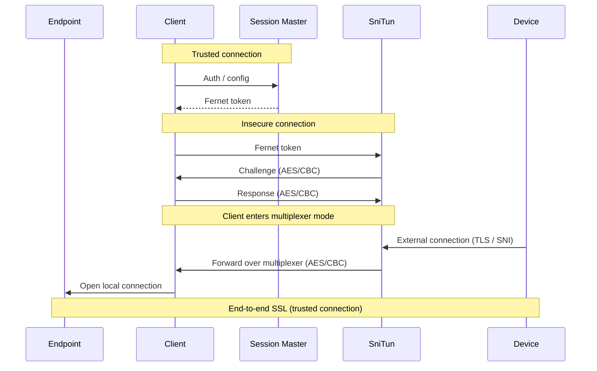

# SniTun

End-to-End encryption with SNI proxy on top of a TCP multiplexer

## Connection flow



## Fernet token

The session master encrypts the client's configuration into a [Fernet](https://cryptography.io/en/latest/fernet/) token. The session master and the SniTun server share the Fernet key(s), so only the SniTun server can decrypt the token; the client just relays it when it connects.

The token payload is a JSON object:

```json
{
  "valid": 1924948800.0,
  "hostname": "myname.ui.nabu.casa",
  "aes_key": "401933e35f9f43d18db1d1de2e5d2e9a9f4c3b2a1d0e9f8c7b6a5d4c3b2a1f0e",
  "aes_iv": "9b2c4d6e8f0a1b3c5d7e9f0a1b2c3d4e",
  "protocol_version": 2,
  "alias": ["www.myname.ui.nabu.casa"]
}
```

| Field              | Type     | Description                                                                                                                                                                    |
| ------------------ | -------- | ------------------------------------------------------------------------------------------------------------------------------------------------------------------------------ |
| `valid`            | float    | Expiry as a UTC Unix timestamp in seconds. The SniTun server rejects the token once this time has passed.                                                                      |
| `hostname`         | string   | Primary hostname (matched against the TLS SNI) that this peer serves.                                                                                                          |
| `aes_key`          | string   | Hex-encoded 32-byte key (AES-256) used to encrypt the multiplexer header.                                                                                                      |
| `aes_iv`           | string   | Hex-encoded 16-byte initialization vector for AES-CBC.                                                                                                                         |
| `protocol_version` | int      | Multiplexer protocol version the client speaks (see [Protocol versioning considerations](#protocol-versioning-considerations)). Optional; the server assumes `0` when omitted. |
| `alias`            | string[] | Additional hostnames the peer also serves. Optional.                                                                                                                           |

The SniTun server must be able to decrypt this token to validate the client's authenticity. SniTun then initiates a challenge-response handling to validate the AES key and ensure that it is the same client that requested the Fernet token from the session master.

Note: SniTun server does not perform any user authentication!

### Challenge/Response

The SniTun server creates a SHA256 hash from a random 40-bit value. This value is encrypted and sent to the client, who then decrypts the value and performs another SHA256 hash with the value and sends it encrypted back to SniTun. If it is valid, the client enters the Multiplexer mode.

## Multiplexer Protocol

The header is encrypted using AES/CBC. The payload should be SSL. The ID changes for every TCP connection and is unique for each connection. The size is for the data payload.

The extra information could include the caller IP address for a `New` message on protocol version < 2. From protocol version 2 the caller IP is sent in the (encrypted) data instead — see the `New` message type below. Otherwise, it is random bits.

```
|________________________________________________________|
|-----------------HEADER---------------------------------|______________________________________________|
|------ID-----|--FLAG--|--SIZE--|---------EXTRA ---------|--------------------DATA----------------------|
|   16 bytes  | 1 byte | 4 bytes|       11 bytes         |                  variable                    |
|--------------------------------------------------------|----------------------------------------------|
```

Message Flags/Types:

- `0x01`: New | Carries the caller IP address.
  - Protocol version < 2: the `EXTRA` field holds the first byte as an ASCII `4` (IPv6 is not supported), followed by the 4-byte IPv4 address; the `data` payload is empty.
  - Protocol version >= 2: the address is sent in the `data` payload (which is encrypted together with the header) as a one-byte family marker (`4` or `6`) followed by the packed address (4 bytes for IPv4, 16 for IPv6), padded with random bytes to an AES block boundary. This keeps the caller IP off the wire in clear text and allows IPv6 to be carried.
- `0x02`: DATA
- `0x04`: Close
- `0x08`: Ping | The extra data is a `ping` or `pong` response to a ping.
- `0x16`: Pause the remote reader (added in protocol version 1)
- `0x32`: Resume the remote reader (added in protocol version 1)

## Configuration via environment variables

The following environment variables, which, to be effective, must be set before importing this package, are available to override internal defaults:

- `MULTIPLEXER_INCOMING_QUEUE_MAX_BYTES_CHANNEL` - The maximum number of bytes allowed in the incoming queue for each multiplexer channel.
- `MULTIPLEXER_INCOMING_QUEUE_MAX_BYTES_CHANNEL_V0` - The maximum number of bytes allowed in the incoming queue for protocol version 0 channels (default: 256MB, larger than standard channels since v0 lacks flow control).
- `MULTIPLEXER_INCOMING_QUEUE_LOW_WATERMARK` - The low watermark threshold, in bytes, for the incoming queue for each multiplexer channel.
- `MULTIPLEXER_INCOMING_QUEUE_HIGH_WATERMARK` - The high watermark threshold, in bytes, for the incoming queue for each multiplexer channel.
- `MULTIPLEXER_OUTGOING_QUEUE_MAX_BYTES_CHANNEL` - The maximum number of bytes allowed in the outgoing queue for the multiplexer channel.
- `MULTIPLEXER_OUTGOING_QUEUE_LOW_WATERMARK` - The low watermark threshold, in bytes, for the outgoing queue for each multiplexer channel.
- `MULTIPLEXER_OUTGOING_QUEUE_HIGH_WATERMARK` - The high watermark threshold, in bytes, for the outgoing queue for each multiplexer channel.

## Protocol versioning considerations

- The client is responsible for setting the `protocol_version` key in the token. If no `protocol_version` is provided, the server must assume protocol version 0.
- The server side must always be updated first when incrementing the protocol version as the client assumes that the server is always running a protocol version that it supports.
- When new message types are added to the Multiplexer, the protocol version must be incremented.
- Both ends of a connection must agree on the protocol version, since some versions change the wire format (see below). The negotiated version is symmetric.

Versions:

- `0`: Base protocol. No flow control. Caller IPv4 in the header `EXTRA` field.
- `1`: Adds reader pause/resume (`0x16`/`0x32`) for flow control.
- `2`: Sends the caller IP in the encrypted `New` message data instead of `EXTRA`, which keeps it off the wire in clear and adds IPv6 support.
