# SniTun Architecture Guide

A beginner-friendly guide to understanding how SniTun works — from the big picture down to individual components.

---

## Table of Contents

1. [What is SniTun?](#what-is-snitun)
2. [The Problem SniTun Solves](#the-problem-snitun-solves)
3. [High-Level Architecture](#high-level-architecture)
4. [Connection Lifecycle](#connection-lifecycle)
5. [Authentication Flow](#authentication-flow)
6. [The Multiplexer System](#the-multiplexer-system)
7. [Message Protocol](#message-protocol)
8. [Flow Control](#flow-control)
9. [Server Components](#server-components)
10. [Client Components](#client-components)
11. [Module Dependency Map](#module-dependency-map)
12. [Class Hierarchy](#class-hierarchy)
13. [Error Handling](#error-handling)
14. [Configuration](#configuration)
15. [File-by-File Reference](#file-by-file-reference)

---

## What is SniTun?

**SniTun** is an end-to-end encrypted **SNI proxy** with a built-in **TCP multiplexer**. In simpler terms:

- **SNI (Server Name Indication)** is a TLS extension that tells a server which hostname the client wants to connect to — *before* encryption starts. SniTun reads this to route traffic.
- **Proxy** means SniTun sits between external users and your device, forwarding traffic.
- **Multiplexer** means a single TCP connection between the SniTun server and your device can carry many independent streams simultaneously (like multiple browser tabs sharing one tunnel).
- **End-to-end encrypted** means all data through the multiplexer is encrypted with AES, so even the SniTun server cannot read the actual content.

---

## The Problem SniTun Solves

Imagine you have a device at home (like a Home Assistant server) behind a firewall/NAT. You want to access it securely from anywhere on the internet.

```
Problem:
  You (on the internet) --X--> [Firewall/NAT] ---> Your Home Device
                         blocked!
```

SniTun solves this by having your device **connect outward** to the SniTun server (outbound connections are usually allowed), and then external requests are routed through that tunnel:

```
Solution:
  You -----> [SniTun Server] <====tunnel====> [Your Device]
             routes by SNI     encrypted       connects outward
```

---

## High-Level Architecture

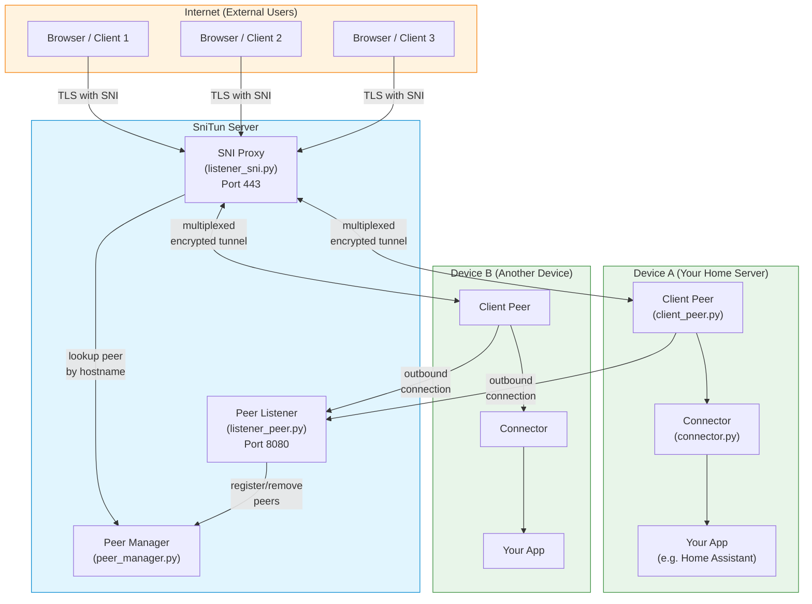
```mermaid
graph TB
    subgraph Internet["Internet (External Users)"]
        EU1["Browser / Client 1"]
        EU2["Browser / Client 2"]
        EU3["Browser / Client 3"]
    end

    subgraph SniTunServer["SniTun Server"]
        SNI["SNI Proxy<br/>(listener_sni.py)<br/>Port 443"]
        PM["Peer Manager<br/>(peer_manager.py)"]
        PL["Peer Listener<br/>(listener_peer.py)<br/>Port 8080"]

        SNI -->|"lookup peer<br/>by hostname"| PM
        PL -->|"register/remove<br/>peers"| PM
    end

    subgraph DeviceA["Device A (Your Home Server)"]
        CP_A["Client Peer<br/>(client_peer.py)"]
        CON_A["Connector<br/>(connector.py)"]
        APP_A["Your App<br/>(e.g. Home Assistant)"]

        CP_A --> CON_A --> APP_A
    end

    subgraph DeviceB["Device B (Another Device)"]
        CP_B["Client Peer"]
        CON_B["Connector"]
        APP_B["Your App"]

        CP_B --> CON_B --> APP_B
    end

    EU1 & EU2 -->|"TLS with SNI"| SNI
    EU3 -->|"TLS with SNI"| SNI

    SNI <-->|"multiplexed<br/>encrypted tunnel"| CP_A
    SNI <-->|"multiplexed<br/>encrypted tunnel"| CP_B

    CP_A -->|"outbound<br/>connection"| PL
    CP_B -->|"outbound<br/>connection"| PL

    style SniTunServer fill:#e1f5fe,stroke:#0288d1
    style DeviceA fill:#e8f5e9,stroke:#388e3c
    style DeviceB fill:#e8f5e9,stroke:#388e3c
    style Internet fill:#fff3e0,stroke:#f57c00
```

**Key insight**: The device initiates the connection to the server (outbound), not the other way around. This bypasses firewalls and NAT.

---

## Connection Lifecycle

This diagram shows the complete lifecycle from device startup to serving a user request:

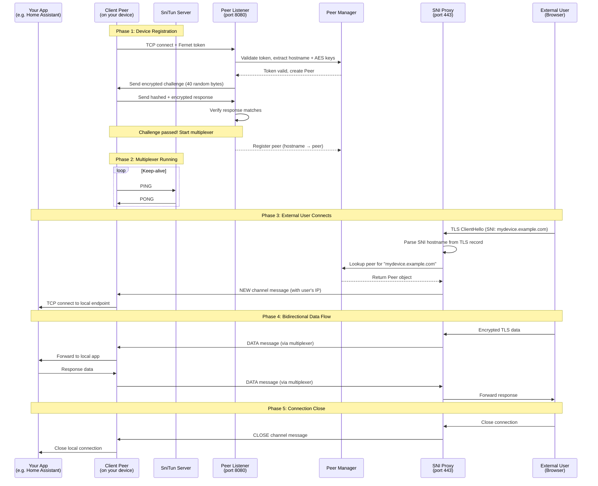
```mermaid
sequenceDiagram
    participant App as Your App<br/>(e.g. Home Assistant)
    participant Client as Client Peer<br/>(on your device)
    participant Server as SniTun Server
    participant PL as Peer Listener<br/>(port 8080)
    participant PM as Peer Manager
    participant SNI as SNI Proxy<br/>(port 443)
    participant User as External User<br/>(Browser)

    Note over Client,Server: Phase 1: Device Registration
    Client->>PL: TCP connect + Fernet token
    PL->>PM: Validate token, extract hostname + AES keys
    PM-->>PL: Token valid, create Peer
    PL->>Client: Send encrypted challenge (40 random bytes)
    Client->>PL: Send hashed + encrypted response
    PL->>PL: Verify response matches
    Note over Client,PL: Challenge passed! Start multiplexer
    PL-->>PM: Register peer (hostname → peer)

    Note over Client,Server: Phase 2: Multiplexer Running
    loop Keep-alive
        Client->>Server: PING
        Server->>Client: PONG
    end

    Note over User,App: Phase 3: External User Connects
    User->>SNI: TLS ClientHello (SNI: mydevice.example.com)
    SNI->>SNI: Parse SNI hostname from TLS record
    SNI->>PM: Lookup peer for "mydevice.example.com"
    PM-->>SNI: Return Peer object
    SNI->>Client: NEW channel message (with user's IP)
    Client->>App: TCP connect to local endpoint

    Note over User,App: Phase 4: Bidirectional Data Flow
    User->>SNI: Encrypted TLS data
    SNI->>Client: DATA message (via multiplexer)
    Client->>App: Forward to local app
    App->>Client: Response data
    Client->>SNI: DATA message (via multiplexer)
    SNI->>User: Forward response

    Note over User,App: Phase 5: Connection Close
    User->>SNI: Close connection
    SNI->>Client: CLOSE channel message
    Client->>App: Close local connection
```

---

## Authentication Flow

SniTun uses a two-step authentication: **Fernet token** + **AES challenge-response**.

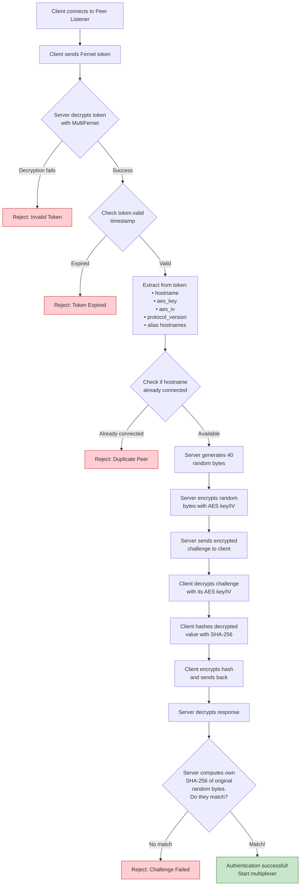
```mermaid
flowchart TD
    A["Client connects to Peer Listener"] --> B["Client sends Fernet token"]
    B --> C{"Server decrypts token<br/>with MultiFernet"}

    C -->|"Decryption fails"| D["Reject: Invalid Token"]
    C -->|"Success"| E{"Check token.valid<br/>timestamp"}

    E -->|"Expired"| F["Reject: Token Expired"]
    E -->|"Valid"| G["Extract from token:<br/>• hostname<br/>• aes_key<br/>• aes_iv<br/>• protocol_version<br/>• alias hostnames"]

    G --> H{"Check if hostname<br/>already connected"}
    H -->|"Already connected"| I["Reject: Duplicate Peer"]
    H -->|"Available"| J["Server generates 40<br/>random bytes"]

    J --> K["Server encrypts random<br/>bytes with AES key/IV"]
    K --> L["Server sends encrypted<br/>challenge to client"]
    L --> M["Client decrypts challenge<br/>with its AES key/IV"]
    M --> N["Client hashes decrypted<br/>value with SHA-256"]
    N --> O["Client encrypts hash<br/>and sends back"]
    O --> P["Server decrypts response"]
    P --> Q{"Server computes own<br/>SHA-256 of original<br/>random bytes.<br/>Do they match?"}

    Q -->|"No match"| R["Reject: Challenge Failed"]
    Q -->|"Match!"| S["Authentication successful!<br/>Start multiplexer"]

    style D fill:#ffcdd2,stroke:#c62828
    style F fill:#ffcdd2,stroke:#c62828
    style I fill:#ffcdd2,stroke:#c62828
    style R fill:#ffcdd2,stroke:#c62828
    style S fill:#c8e6c9,stroke:#2e7d32
```

### What's inside a Fernet token?

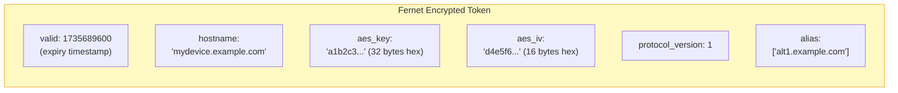
```mermaid
graph LR
    subgraph Token["Fernet Encrypted Token"]
        V["valid: 1735689600<br/>(expiry timestamp)"]
        H["hostname:<br/>'mydevice.example.com'"]
        AK["aes_key:<br/>'a1b2c3...' (32 bytes hex)"]
        AI["aes_iv:<br/>'d4e5f6...' (16 bytes hex)"]
        PV["protocol_version: 1"]
        AL["alias:<br/>['alt1.example.com']"]
    end

    style Token fill:#fff9c4,stroke:#f9a825
```

---

## The Multiplexer System

The multiplexer is the heart of SniTun. It allows many independent streams (channels) to share a single TCP connection.

### How Multiplexing Works

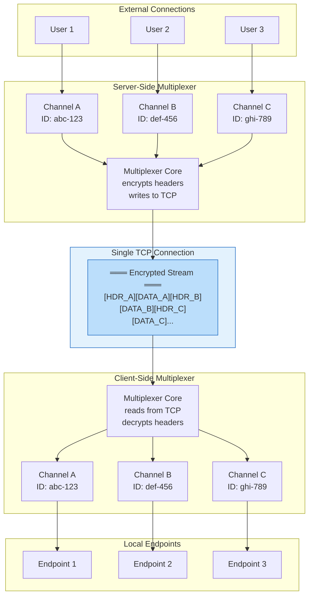
```mermaid
graph TB
    subgraph External["External Connections"]
        U1["User 1"]
        U2["User 2"]
        U3["User 3"]
    end

    subgraph MuxServer["Server-Side Multiplexer"]
        CH1_S["Channel A<br/>ID: abc-123"]
        CH2_S["Channel B<br/>ID: def-456"]
        CH3_S["Channel C<br/>ID: ghi-789"]
        CORE_S["Multiplexer Core<br/>encrypts headers<br/>writes to TCP"]
    end

    subgraph TCP["Single TCP Connection"]
        WIRE["═══ Encrypted Stream ═══<br/>[HDR_A][DATA_A][HDR_B][DATA_B][HDR_C][DATA_C]..."]
    end

    subgraph MuxClient["Client-Side Multiplexer"]
        CORE_C["Multiplexer Core<br/>reads from TCP<br/>decrypts headers"]
        CH1_C["Channel A<br/>ID: abc-123"]
        CH2_C["Channel B<br/>ID: def-456"]
        CH3_C["Channel C<br/>ID: ghi-789"]
    end

    subgraph Local["Local Endpoints"]
        E1["Endpoint 1"]
        E2["Endpoint 2"]
        E3["Endpoint 3"]
    end

    U1 --> CH1_S
    U2 --> CH2_S
    U3 --> CH3_S

    CH1_S & CH2_S & CH3_S --> CORE_S
    CORE_S --> WIRE
    WIRE --> CORE_C
    CORE_C --> CH1_C & CH2_C & CH3_C

    CH1_C --> E1
    CH2_C --> E2
    CH3_C --> E3

    style TCP fill:#e3f2fd,stroke:#1565c0
    style WIRE fill:#bbdefb,stroke:#1565c0
```

### Multiplexer Internal Architecture

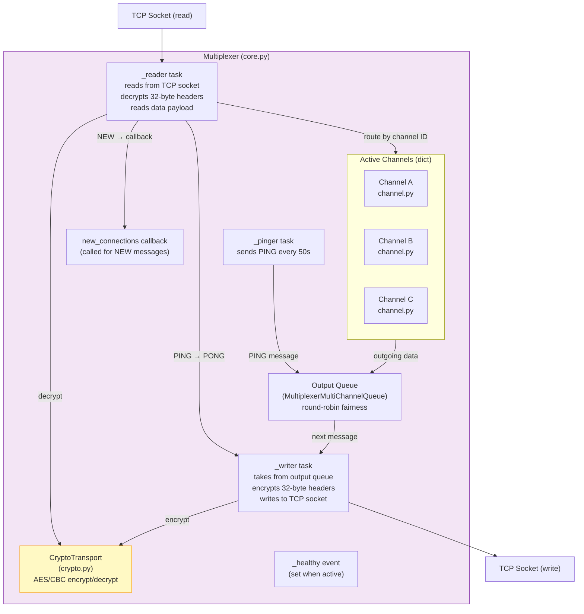
```mermaid
graph TB
    subgraph Multiplexer["Multiplexer (core.py)"]
        direction TB

        READER["_reader task<br/>reads from TCP socket<br/>decrypts 32-byte headers<br/>reads data payload"]
        WRITER["_writer task<br/>takes from output queue<br/>encrypts 32-byte headers<br/>writes to TCP socket"]

        subgraph Channels["Active Channels (dict)"]
            CH_A["Channel A<br/>channel.py"]
            CH_B["Channel B<br/>channel.py"]
            CH_C["Channel C<br/>channel.py"]
        end

        CRYPTO["CryptoTransport<br/>(crypto.py)<br/>AES/CBC encrypt/decrypt"]
        NEW_CB["new_connections callback<br/>(called for NEW messages)"]
        HEALTHY["_healthy event<br/>(set when active)"]
        PING_T["_pinger task<br/>sends PING every 50s"]

        OUT_Q["Output Queue<br/>(MultiplexerMultiChannelQueue)<br/>round-robin fairness"]

        READER -->|"route by channel ID"| Channels
        READER -->|"PING → PONG"| WRITER
        READER -->|"NEW → callback"| NEW_CB
        READER -->|"decrypt"| CRYPTO
        WRITER -->|"encrypt"| CRYPTO
        Channels -->|"outgoing data"| OUT_Q
        OUT_Q -->|"next message"| WRITER
        PING_T -->|"PING message"| OUT_Q
    end

    TCP_IN["TCP Socket (read)"] --> READER
    WRITER --> TCP_OUT["TCP Socket (write)"]

    style Multiplexer fill:#f3e5f5,stroke:#7b1fa2
    style CRYPTO fill:#fff9c4,stroke:#f9a825
```

---

## Message Protocol

Every message through the multiplexer has this structure:

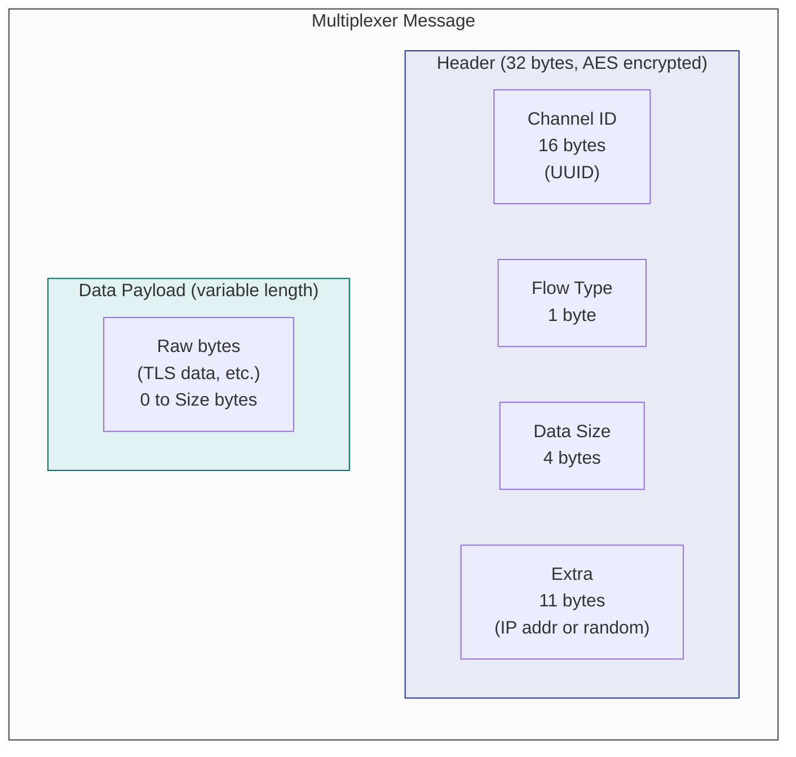
```mermaid
graph LR
    subgraph Message["Multiplexer Message"]
        subgraph Header["Header (32 bytes, AES encrypted)"]
            ID["Channel ID<br/>16 bytes<br/>(UUID)"]
            FT["Flow Type<br/>1 byte"]
            SZ["Data Size<br/>4 bytes"]
            EX["Extra<br/>11 bytes<br/>(IP addr or random)"]
        end
        subgraph Payload["Data Payload (variable length)"]
            DATA["Raw bytes<br/>(TLS data, etc.)<br/>0 to Size bytes"]
        end
    end

    style Header fill:#e8eaf6,stroke:#283593
    style Payload fill:#e0f2f1,stroke:#00695c
    style Message fill:#fafafa,stroke:#424242
```

### Flow Types

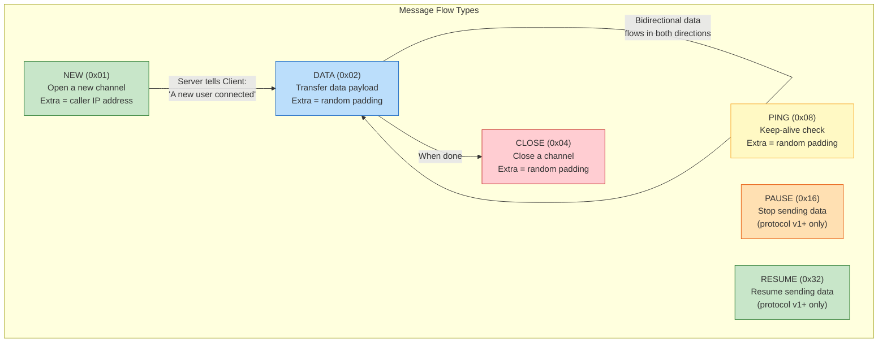
```mermaid
graph TD
    subgraph FlowTypes["Message Flow Types"]
        NEW["NEW (0x01)<br/>Open a new channel<br/>Extra = caller IP address"]
        DATA["DATA (0x02)<br/>Transfer data payload<br/>Extra = random padding"]
        CLOSE["CLOSE (0x04)<br/>Close a channel<br/>Extra = random padding"]
        PING["PING (0x08)<br/>Keep-alive check<br/>Extra = random padding"]
        PAUSE["PAUSE (0x16)<br/>Stop sending data<br/>(protocol v1+ only)"]
        RESUME["RESUME (0x32)<br/>Resume sending data<br/>(protocol v1+ only)"]
    end

    NEW --> |"Server tells Client:<br/>'A new user connected'"| DATA
    DATA --> |"Bidirectional data<br/>flows in both directions"| DATA
    DATA --> |"When done"| CLOSE

    style NEW fill:#c8e6c9,stroke:#2e7d32
    style DATA fill:#bbdefb,stroke:#1565c0
    style CLOSE fill:#ffcdd2,stroke:#c62828
    style PING fill:#fff9c4,stroke:#f9a825
    style PAUSE fill:#ffe0b2,stroke:#e65100
    style RESUME fill:#c8e6c9,stroke:#2e7d32
```

---

## Flow Control

Flow control prevents fast senders from overwhelming slow receivers. It was introduced in protocol version 1.

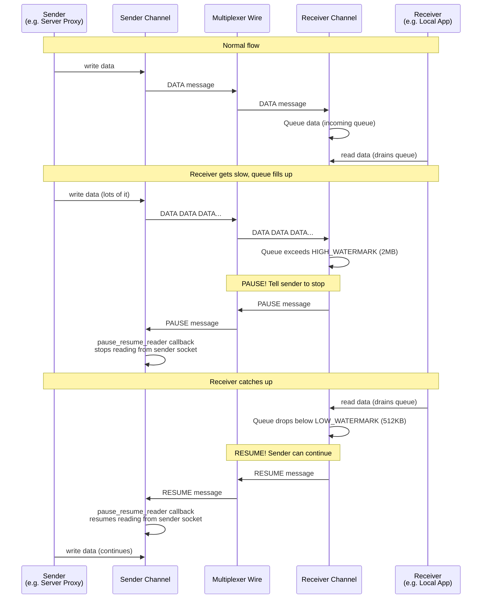
```mermaid
sequenceDiagram
    participant Sender as Sender<br/>(e.g. Server Proxy)
    participant SenderCH as Sender Channel
    participant MUX as Multiplexer Wire
    participant ReceiverCH as Receiver Channel
    participant Receiver as Receiver<br/>(e.g. Local App)

    Note over Sender,Receiver: Normal flow
    Sender->>SenderCH: write data
    SenderCH->>MUX: DATA message
    MUX->>ReceiverCH: DATA message
    ReceiverCH->>ReceiverCH: Queue data (incoming queue)
    Receiver->>ReceiverCH: read data (drains queue)

    Note over Sender,Receiver: Receiver gets slow, queue fills up
    Sender->>SenderCH: write data (lots of it)
    SenderCH->>MUX: DATA DATA DATA...
    MUX->>ReceiverCH: DATA DATA DATA...
    ReceiverCH->>ReceiverCH: Queue exceeds HIGH_WATERMARK (2MB)

    Note over ReceiverCH,MUX: PAUSE! Tell sender to stop
    ReceiverCH->>MUX: PAUSE message
    MUX->>SenderCH: PAUSE message
    SenderCH->>SenderCH: pause_resume_reader callback<br/>stops reading from sender socket

    Note over Sender,Receiver: Receiver catches up
    Receiver->>ReceiverCH: read data (drains queue)
    ReceiverCH->>ReceiverCH: Queue drops below LOW_WATERMARK (512KB)

    Note over ReceiverCH,MUX: RESUME! Sender can continue
    ReceiverCH->>MUX: RESUME message
    MUX->>SenderCH: RESUME message
    SenderCH->>SenderCH: pause_resume_reader callback<br/>resumes reading from sender socket
    Sender->>SenderCH: write data (continues)
```

### Queue Water Marks

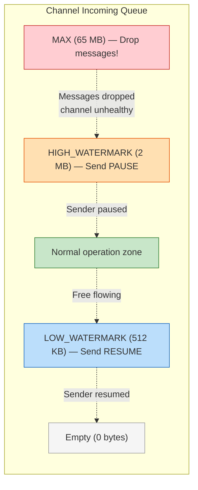
```mermaid
graph TD
    subgraph Queue["Channel Incoming Queue"]
        direction TB
        MAX["MAX (65 MB) — Drop messages!"]
        HIGH["HIGH_WATERMARK (2 MB) — Send PAUSE"]
        NORMAL["Normal operation zone"]
        LOW["LOW_WATERMARK (512 KB) — Send RESUME"]
        EMPTY["Empty (0 bytes)"]
    end

    MAX -.->|"Messages dropped<br/>channel unhealthy"| HIGH
    HIGH -.->|"Sender paused"| NORMAL
    NORMAL -.->|"Free flowing"| LOW
    LOW -.->|"Sender resumed"| EMPTY

    style MAX fill:#ffcdd2,stroke:#c62828
    style HIGH fill:#ffe0b2,stroke:#e65100
    style NORMAL fill:#c8e6c9,stroke:#2e7d32
    style LOW fill:#bbdefb,stroke:#1565c0
    style EMPTY fill:#f5f5f5,stroke:#9e9e9e
```

---

## Server Components

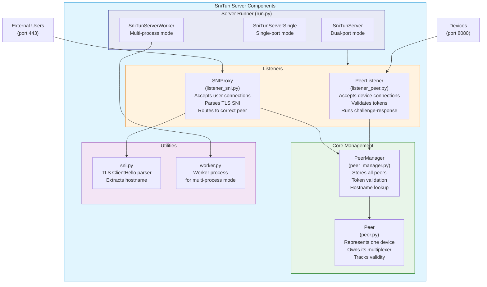
```mermaid
graph TB
    subgraph Server["SniTun Server Components"]
        direction TB

        subgraph RunLayer["Server Runner (run.py)"]
            STS["SniTunServer<br/>Dual-port mode"]
            STSS["SniTunServerSingle<br/>Single-port mode"]
            STSW["SniTunServerWorker<br/>Multi-process mode"]
        end

        subgraph Listeners["Listeners"]
            PL["PeerListener<br/>(listener_peer.py)<br/>Accepts device connections<br/>Validates tokens<br/>Runs challenge-response"]
            SNIP["SNIProxy<br/>(listener_sni.py)<br/>Accepts user connections<br/>Parses TLS SNI<br/>Routes to correct peer"]
        end

        subgraph Core["Core Management"]
            PM["PeerManager<br/>(peer_manager.py)<br/>Stores all peers<br/>Token validation<br/>Hostname lookup"]
            PEER["Peer<br/>(peer.py)<br/>Represents one device<br/>Owns its multiplexer<br/>Tracks validity"]
        end

        subgraph Utilities["Utilities"]
            SNI_PARSE["sni.py<br/>TLS ClientHello parser<br/>Extracts hostname"]
            WORKER["worker.py<br/>Worker process<br/>for multi-process mode"]
        end

        RunLayer --> Listeners
        PL --> PM
        SNIP --> PM
        PM --> PEER
        SNIP --> SNI_PARSE
        STSW --> WORKER
    end

    EXT["External Users<br/>(port 443)"] --> SNIP
    DEV["Devices<br/>(port 8080)"] --> PL

    style Server fill:#e1f5fe,stroke:#0288d1
    style RunLayer fill:#e8eaf6,stroke:#283593
    style Listeners fill:#fff3e0,stroke:#f57c00
    style Core fill:#e8f5e9,stroke:#388e3c
    style Utilities fill:#f3e5f5,stroke:#7b1fa2
```

### Server Deployment Modes

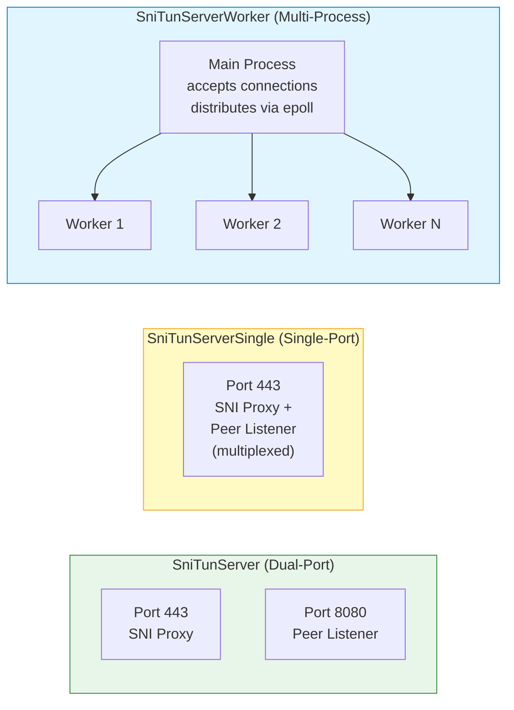
```mermaid
graph LR
    subgraph Dual["SniTunServer (Dual-Port)"]
        P443_D["Port 443<br/>SNI Proxy"]
        P8080_D["Port 8080<br/>Peer Listener"]
    end

    subgraph Single["SniTunServerSingle (Single-Port)"]
        P443_S["Port 443<br/>SNI Proxy +<br/>Peer Listener<br/>(multiplexed)"]
    end

    subgraph Worker["SniTunServerWorker (Multi-Process)"]
        MAIN["Main Process<br/>accepts connections<br/>distributes via epoll"]
        W1["Worker 1"]
        W2["Worker 2"]
        W3["Worker N"]
        MAIN --> W1 & W2 & W3
    end

    style Dual fill:#e8f5e9,stroke:#388e3c
    style Single fill:#fff9c4,stroke:#f9a825
    style Worker fill:#e1f5fe,stroke:#0288d1
```

### SNI Parsing Detail

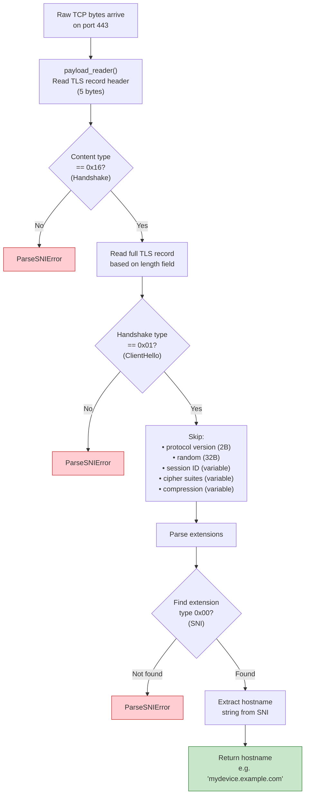
```mermaid
flowchart TD
    A["Raw TCP bytes arrive<br/>on port 443"] --> B["payload_reader()<br/>Read TLS record header<br/>(5 bytes)"]
    B --> C{"Content type<br/>== 0x16?<br/>(Handshake)"}
    C -->|"No"| D["ParseSNIError"]
    C -->|"Yes"| E["Read full TLS record<br/>based on length field"]
    E --> F{"Handshake type<br/>== 0x01?<br/>(ClientHello)"}
    F -->|"No"| G["ParseSNIError"]
    F -->|"Yes"| H["Skip:<br/>• protocol version (2B)<br/>• random (32B)<br/>• session ID (variable)<br/>• cipher suites (variable)<br/>• compression (variable)"]
    H --> I["Parse extensions"]
    I --> J{"Find extension<br/>type 0x00?<br/>(SNI)"}
    J -->|"Not found"| K["ParseSNIError"]
    J -->|"Found"| L["Extract hostname<br/>string from SNI"]
    L --> M["Return hostname<br/>e.g. 'mydevice.example.com'"]

    style D fill:#ffcdd2,stroke:#c62828
    style G fill:#ffcdd2,stroke:#c62828
    style K fill:#ffcdd2,stroke:#c62828
    style M fill:#c8e6c9,stroke:#2e7d32
```

---

## Client Components

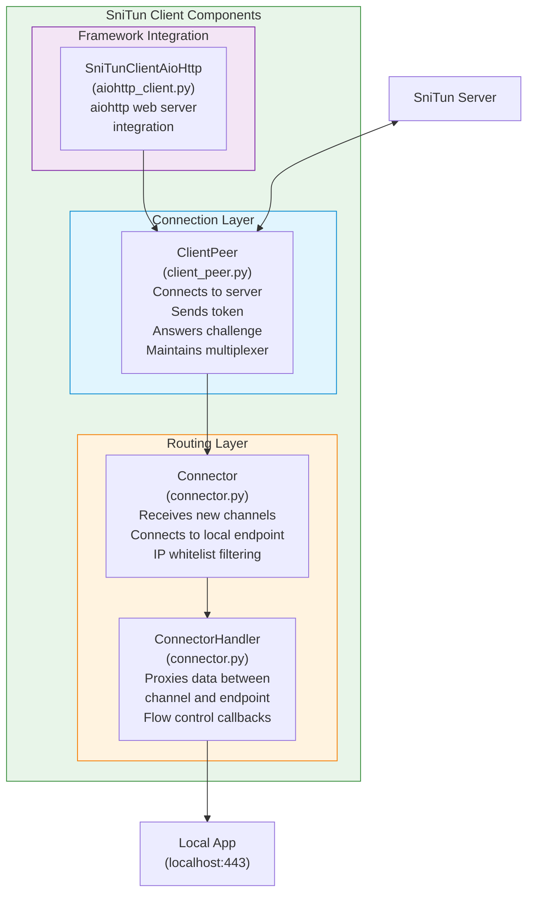
```mermaid
graph TB
    subgraph Client["SniTun Client Components"]
        direction TB

        subgraph Connection["Connection Layer"]
            CP["ClientPeer<br/>(client_peer.py)<br/>Connects to server<br/>Sends token<br/>Answers challenge<br/>Maintains multiplexer"]
        end

        subgraph Routing["Routing Layer"]
            CON["Connector<br/>(connector.py)<br/>Receives new channels<br/>Connects to local endpoint<br/>IP whitelist filtering"]
            CH["ConnectorHandler<br/>(connector.py)<br/>Proxies data between<br/>channel and endpoint<br/>Flow control callbacks"]
        end

        subgraph Integration["Framework Integration"]
            AIOHTTP["SniTunClientAioHttp<br/>(aiohttp_client.py)<br/>aiohttp web server<br/>integration"]
        end

        CP --> CON
        CON --> CH
        AIOHTTP --> CP
    end

    SERVER["SniTun Server"] <--> CP
    CH --> LOCAL["Local App<br/>(localhost:443)"]

    style Client fill:#e8f5e9,stroke:#388e3c
    style Connection fill:#e1f5fe,stroke:#0288d1
    style Routing fill:#fff3e0,stroke:#f57c00
    style Integration fill:#f3e5f5,stroke:#7b1fa2
```

### Client Connection Flow

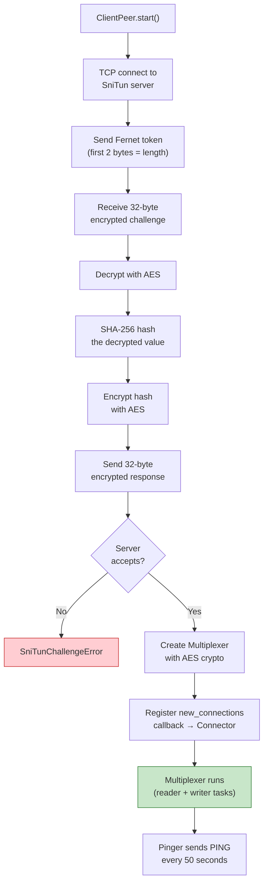
```mermaid
flowchart TD
    A["ClientPeer.start()"] --> B["TCP connect to<br/>SniTun server"]
    B --> C["Send Fernet token<br/>(first 2 bytes = length)"]
    C --> D["Receive 32-byte<br/>encrypted challenge"]
    D --> E["Decrypt with AES"]
    E --> F["SHA-256 hash<br/>the decrypted value"]
    F --> G["Encrypt hash<br/>with AES"]
    G --> H["Send 32-byte<br/>encrypted response"]
    H --> I{"Server<br/>accepts?"}
    I -->|"No"| J["SniTunChallengeError"]
    I -->|"Yes"| K["Create Multiplexer<br/>with AES crypto"]
    K --> L["Register new_connections<br/>callback → Connector"]
    L --> M["Multiplexer runs<br/>(reader + writer tasks)"]
    M --> N["Pinger sends PING<br/>every 50 seconds"]

    style J fill:#ffcdd2,stroke:#c62828
    style M fill:#c8e6c9,stroke:#2e7d32
```

---

## Module Dependency Map

This shows which modules import from which other modules:

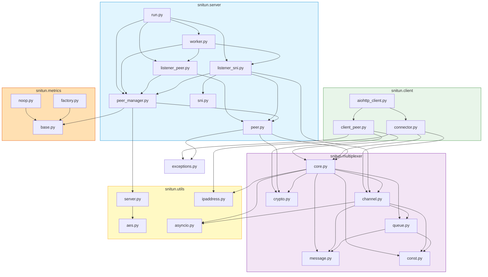
```mermaid
graph TD
    subgraph ClientPkg["snitun.client"]
        client_peer["client_peer.py"]
        connector["connector.py"]
        aiohttp_client["aiohttp_client.py"]
    end

    subgraph ServerPkg["snitun.server"]
        run["run.py"]
        worker["worker.py"]
        listener_peer["listener_peer.py"]
        listener_sni["listener_sni.py"]
        peer["peer.py"]
        peer_manager["peer_manager.py"]
        sni_parser["sni.py"]
    end

    subgraph MuxPkg["snitun.multiplexer"]
        core["core.py"]
        channel["channel.py"]
        queue["queue.py"]
        crypto["crypto.py"]
        message["message.py"]
        mux_const["const.py"]
    end

    subgraph UtilsPkg["snitun.utils"]
        aes["aes.py"]
        server_utils["server.py"]
        ip_utils["ipaddress.py"]
        async_utils["asyncio.py"]
    end

    subgraph MetricsPkg["snitun.metrics"]
        metrics_base["base.py"]
        metrics_noop["noop.py"]
        metrics_factory["factory.py"]
    end

    exceptions["exceptions.py"]

    %% Client dependencies
    client_peer --> core
    client_peer --> crypto
    client_peer --> exceptions
    connector --> channel
    connector --> core
    connector --> ip_utils
    aiohttp_client --> client_peer
    aiohttp_client --> connector

    %% Server dependencies
    run --> listener_peer
    run --> listener_sni
    run --> peer_manager
    run --> worker
    worker --> listener_peer
    worker --> listener_sni
    worker --> peer_manager
    listener_peer --> peer_manager
    listener_peer --> peer
    listener_sni --> peer_manager
    listener_sni --> peer
    listener_sni --> sni_parser
    listener_sni --> channel
    peer --> core
    peer --> crypto
    peer --> exceptions
    peer_manager --> peer
    peer_manager --> server_utils
    peer_manager --> metrics_base

    %% Multiplexer internal
    core --> channel
    core --> queue
    core --> crypto
    core --> message
    core --> mux_const
    core --> ip_utils
    core --> async_utils
    channel --> queue
    channel --> message
    channel --> mux_const
    channel --> async_utils
    queue --> message
    queue --> mux_const

    %% Metrics
    metrics_noop --> metrics_base
    metrics_factory --> metrics_base

    %% Utils
    server_utils --> aes

    style ClientPkg fill:#e8f5e9,stroke:#388e3c
    style ServerPkg fill:#e1f5fe,stroke:#0288d1
    style MuxPkg fill:#f3e5f5,stroke:#7b1fa2
    style UtilsPkg fill:#fff9c4,stroke:#f9a825
    style MetricsPkg fill:#ffe0b2,stroke:#e65100
```

---

## Class Hierarchy

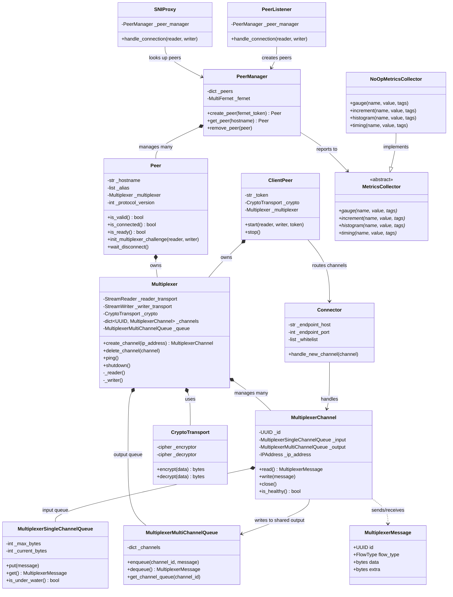
```mermaid
classDiagram
    class Multiplexer {
        -StreamReader _reader_transport
        -StreamWriter _writer_transport
        -CryptoTransport _crypto
        -dict~UUID, MultiplexerChannel~ _channels
        -MultiplexerMultiChannelQueue _queue
        +create_channel(ip_address) MultiplexerChannel
        +delete_channel(channel)
        +ping()
        +shutdown()
        -_reader()
        -_writer()
    }

    class MultiplexerChannel {
        -UUID _id
        -MultiplexerSingleChannelQueue _input
        -MultiplexerMultiChannelQueue _output
        -IPAddress _ip_address
        +read() MultiplexerMessage
        +write(message)
        +close()
        +is_healthy() bool
    }

    class MultiplexerMultiChannelQueue {
        -dict _channels
        +enqueue(channel_id, message)
        +dequeue() MultiplexerMessage
        +get_channel_queue(channel_id)
    }

    class MultiplexerSingleChannelQueue {
        -int _max_bytes
        -int _current_bytes
        +put(message)
        +get() MultiplexerMessage
        +is_under_water() bool
    }

    class CryptoTransport {
        -cipher _encryptor
        -cipher _decryptor
        +encrypt(data) bytes
        +decrypt(data) bytes
    }

    class MultiplexerMessage {
        +UUID id
        +FlowType flow_type
        +bytes data
        +bytes extra
    }

    class Peer {
        -str _hostname
        -list _alias
        -Multiplexer _multiplexer
        -int _protocol_version
        +is_valid() bool
        +is_connected() bool
        +is_ready() bool
        +init_multiplexer_challenge(reader, writer)
        +wait_disconnect()
    }

    class PeerManager {
        -dict _peers
        -MultiFernet _fernet
        +create_peer(fernet_token) Peer
        +get_peer(hostname) Peer
        +remove_peer(peer)
    }

    class SNIProxy {
        -PeerManager _peer_manager
        +handle_connection(reader, writer)
    }

    class PeerListener {
        -PeerManager _peer_manager
        +handle_connection(reader, writer)
    }

    class ClientPeer {
        -str _token
        -CryptoTransport _crypto
        -Multiplexer _multiplexer
        +start(reader, writer, token)
        +stop()
    }

    class Connector {
        -str _endpoint_host
        -int _endpoint_port
        -list _whitelist
        +handle_new_channel(channel)
    }

    class MetricsCollector {
        <<abstract>>
        +gauge(name, value, tags)*
        +increment(name, value, tags)*
        +histogram(name, value, tags)*
        +timing(name, value, tags)*
    }

    class NoOpMetricsCollector {
        +gauge(name, value, tags)
        +increment(name, value, tags)
        +histogram(name, value, tags)
        +timing(name, value, tags)
    }

    Multiplexer *-- MultiplexerChannel : manages many
    Multiplexer *-- CryptoTransport : uses
    Multiplexer *-- MultiplexerMultiChannelQueue : output queue
    MultiplexerChannel *-- MultiplexerSingleChannelQueue : input queue
    MultiplexerChannel --> MultiplexerMultiChannelQueue : writes to shared output
    MultiplexerChannel ..> MultiplexerMessage : sends/receives
    Peer *-- Multiplexer : owns
    PeerManager *-- Peer : manages many
    PeerManager --> MetricsCollector : reports to
    SNIProxy --> PeerManager : looks up peers
    PeerListener --> PeerManager : creates peers
    ClientPeer *-- Multiplexer : owns
    ClientPeer --> Connector : routes channels
    Connector --> MultiplexerChannel : handles
    NoOpMetricsCollector --|> MetricsCollector : implements
```

---

## Error Handling

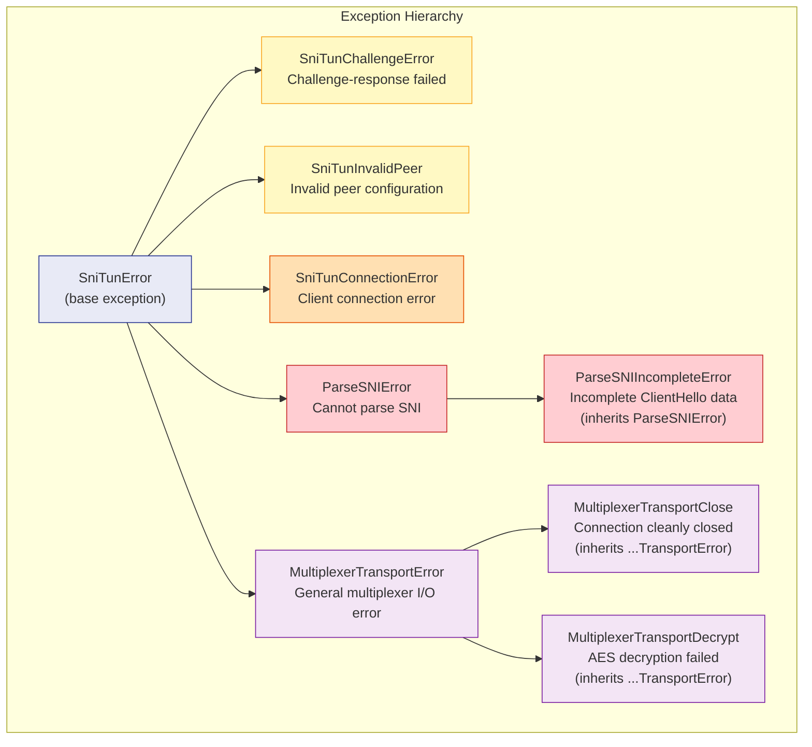
```mermaid
graph TD
    subgraph Exceptions["Exception Hierarchy"]
        BASE["SniTunError<br/>(base exception)"]

        AUTH1["SniTunChallengeError<br/>Challenge-response failed"]
        AUTH2["SniTunInvalidPeer<br/>Invalid peer configuration"]
        CONN["SniTunConnectionError<br/>Client connection error"]

        SNI1["ParseSNIError<br/>Cannot parse SNI"]
        SNI2["ParseSNIIncompleteError<br/>Incomplete ClientHello data<br/>(inherits ParseSNIError)"]

        MUX1["MultiplexerTransportError<br/>General multiplexer I/O error"]
        MUX2["MultiplexerTransportClose<br/>Connection cleanly closed<br/>(inherits ...TransportError)"]
        MUX3["MultiplexerTransportDecrypt<br/>AES decryption failed<br/>(inherits ...TransportError)"]

        BASE --> AUTH1 & AUTH2 & CONN & SNI1 & MUX1
        SNI1 --> SNI2
        MUX1 --> MUX2 & MUX3
    end

    style BASE fill:#e8eaf6,stroke:#283593
    style AUTH1 fill:#fff9c4,stroke:#f9a825
    style AUTH2 fill:#fff9c4,stroke:#f9a825
    style CONN fill:#ffe0b2,stroke:#e65100
    style SNI1 fill:#ffcdd2,stroke:#c62828
    style SNI2 fill:#ffcdd2,stroke:#c62828
    style MUX1 fill:#f3e5f5,stroke:#7b1fa2
    style MUX2 fill:#f3e5f5,stroke:#7b1fa2
    style MUX3 fill:#f3e5f5,stroke:#7b1fa2
```

---

## Configuration

All queue sizes are configurable via environment variables:

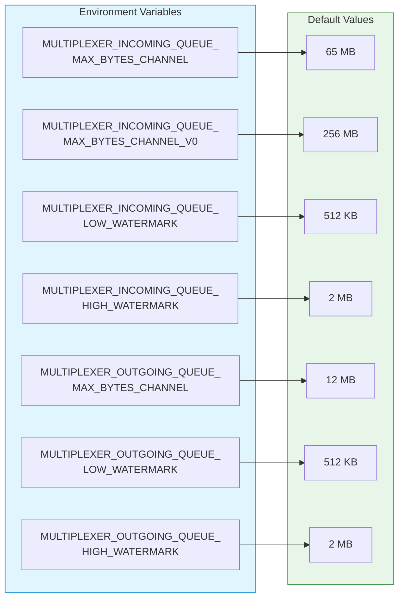
```mermaid
graph LR
    subgraph EnvVars["Environment Variables"]
        E1["MULTIPLEXER_INCOMING_QUEUE_<br/>MAX_BYTES_CHANNEL"]
        E2["MULTIPLEXER_INCOMING_QUEUE_<br/>MAX_BYTES_CHANNEL_V0"]
        E3["MULTIPLEXER_INCOMING_QUEUE_<br/>LOW_WATERMARK"]
        E4["MULTIPLEXER_INCOMING_QUEUE_<br/>HIGH_WATERMARK"]
        E5["MULTIPLEXER_OUTGOING_QUEUE_<br/>MAX_BYTES_CHANNEL"]
        E6["MULTIPLEXER_OUTGOING_QUEUE_<br/>LOW_WATERMARK"]
        E7["MULTIPLEXER_OUTGOING_QUEUE_<br/>HIGH_WATERMARK"]
    end

    subgraph Defaults["Default Values"]
        D1["65 MB"]
        D2["256 MB"]
        D3["512 KB"]
        D4["2 MB"]
        D5["12 MB"]
        D6["512 KB"]
        D7["2 MB"]
    end

    E1 --> D1
    E2 --> D2
    E3 --> D3
    E4 --> D4
    E5 --> D5
    E6 --> D6
    E7 --> D7

    style EnvVars fill:#e1f5fe,stroke:#0288d1
    style Defaults fill:#e8f5e9,stroke:#388e3c
```

---

## File-by-File Reference

### Multiplexer Package (`snitun/multiplexer/`)

| File | Purpose |
|------|---------|
| `core.py` | Main multiplexer engine — reader/writer tasks, channel management, ping/pong |
| `channel.py` | Individual channel (stream) — input/output queues, flow control, health tracking |
| `queue.py` | Queue implementations — single-channel (byte-limited) and multi-channel (round-robin) |
| `message.py` | Message dataclass and FlowType enum — the wire protocol definition |
| `crypto.py` | AES/CBC encryption wrapper — encrypts/decrypts 32-byte headers |
| `const.py` | Constants — queue sizes, watermarks, timeouts (env-var configurable) |

### Server Package (`snitun/server/`)

| File | Purpose |
|------|---------|
| `run.py` | Server entry points — three modes: dual-port, single-port, multi-process |
| `worker.py` | Worker process for multi-process mode — runs its own SNI proxy + peer listener |
| `listener_peer.py` | Peer listener — accepts device connections, validates tokens, runs challenge |
| `listener_sni.py` | SNI proxy — accepts external connections, parses SNI, routes to peer |
| `peer.py` | Peer object — represents one connected device, owns its multiplexer |
| `peer_manager.py` | Peer manager — registry of all connected peers, token validation |
| `sni.py` | TLS SNI parser — extracts hostname from ClientHello message |

### Client Package (`snitun/client/`)

| File | Purpose |
|------|---------|
| `client_peer.py` | Client peer — connects to server, answers challenge, runs multiplexer |
| `connector.py` | Connector — routes new channels to local endpoints, IP whitelist |

### Utils Package (`snitun/utils/`)

| File | Purpose |
|------|---------|
| `aes.py` | AES key generation — random 32-byte key + 16-byte IV |
| `server.py` | Server utilities — Fernet token creation, protocol constants |
| `ipaddress.py` | IP address conversion — bytes ↔ IPv4Address with LRU cache |
| `asyncio.py` | Async helpers — eager task creation, task waiter futures |
| `aiohttp_client.py` | aiohttp integration — wraps SniTun client for aiohttp web servers |

### Metrics Package (`snitun/metrics/`)

| File | Purpose |
|------|---------|
| `base.py` | Abstract MetricsCollector — gauge, increment, histogram, timing |
| `noop.py` | No-op implementation — zero overhead when metrics not needed |
| `factory.py` | Factory type alias — `Callable[[], MetricsCollector]` |

### Root

| File | Purpose |
|------|---------|
| `exceptions.py` | All custom exceptions — organized hierarchy for error handling |
